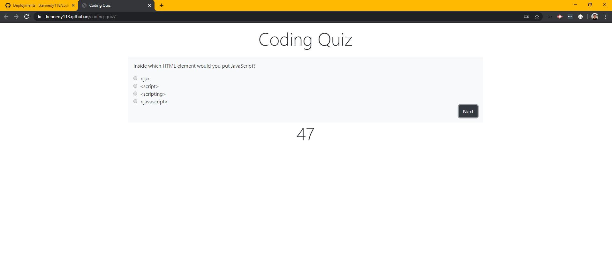

# coding-quiz
[Link to Deployed Application](https://tkennedy118.github.io/coding-quiz/)

# Description
A series of coding questions is presented to the user. The user selects answers until time runs out or
until he/she is finished. Once the user is finished, he may input his initials and save his score to
local storage. Technologies used include CSS, Bootstrap, Javascript, jQuery, and HTML5.

## Files:
* index.html
* style.css
* script.js

## Screenshot of Deployed Application

